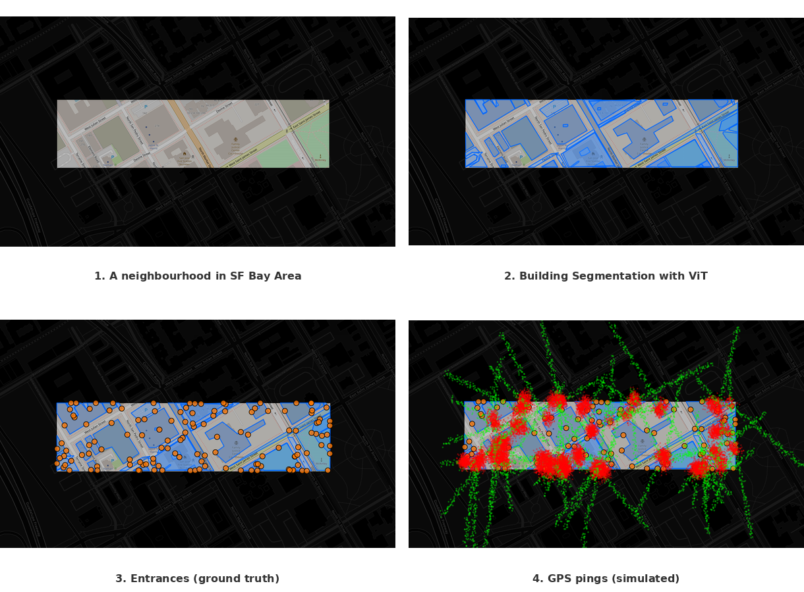

# Geospatial ML Pipeline for Building Entrance Prediction



A comprehensive machine learning pipeline that predicts building entrances from GPS traces.

## 🏗️ System Architecture

This project implements a complete end-to-end pipeline:

1. **Raster Generation**: Downloads OpenStreetMap tiles for SF Bay Area localities
2. **Building Segmentation**: Simulates SAM (Segment Anything Model) to detect buildings
3. **Entrance Generation**: Creates ground truth entrance points based on building geometry
4. **GPS Simulation**: Generates realistic user movement patterns around buildings
5. **Deep Learning Model**: Predicts entrance locations from GPS trace patterns
6. **Visualization Platform**: Interactive web app to explore data and model predictions

## 🚀 Quick Start


### Installation

```bash
# Clone the repository
git clone <repository-url>
cd geospatial-ml-pipeline

# Create virtual environment
python -m venv venv
source venv/bin/activate  # On Windows: venv\Scripts\activate

# Install dependencies
pip install -r requirements.txt

# Create required directories
mkdir -p data/{rasters,shapefiles,entrances,gps_traces,metadata,test}
mkdir -p models
mkdir -p templates static
```

### Server Installation (Quick Setup)

If you just want to run the web server without going through the full pipeline:

```bash
# Clone the repository
git clone <repository-url>
cd geospatial-app

# Create and activate virtual environment
python -m venv ../env
source ../env/bin/activate  # On Windows: ..\env\Scripts\activate

# Install server dependencies
pip install -r server_requirements.txt

# Run the app
python app_updated.py
# Access at http://localhost:5000

# Or run in background with logging
chmod +x run_app.sh
./run_app.sh
# View logs: tail -f logs.txt
```

### Running the Pipeline

Execute each step in order:

```bash
# Step 1: Generate raster files (satellite imagery)
python generate_raster.py
# This will download ~100 satellite images of SF Bay Area locations

# Step 2: Segment buildings from rasters
python segment_buildings.py
# Detects building footprints and saves as shapefiles

# Step 3: Generate entrance points
python generate_entrances.py
# Creates 1-5 entrances per building based on size

# Step 4: Simulate GPS traces
python simulate_gps.py
# Generates realistic user movement patterns

# Step 5: Train the ML model
python train_model.py
# Trains a neural network to predict entrances from GPS data

# Step 6: Launch visualization app
python app_updated.py
# Access at http://localhost:80
```

## 📁 Project Structure

```
geospatial-ml-pipeline/
├── generate_raster.py      # Downloads satellite imagery
├── segment_buildings.py    # Building detection (simulated SAM)
├── generate_entrances.py   # Ground truth entrance generation
├── simulate_gps.py         # GPS trace simulation
├── train_model.py          # Deep learning model training
├── app.py                  # Basic Flask visualization
├── app_updated.py          # Enhanced Flask app with predictions
├── requirements.txt        # Python dependencies
├── README.md              # This file
├── data/                  # Generated data directory
│   ├── rasters/          # Satellite images
│   ├── shapefiles/       # Building polygons
│   ├── entrances/        # Entrance points
│   ├── gps_traces/       # Simulated GPS data
│   └── metadata/         # Coordinate mappings
├── models/               # Trained models
├── templates/            # HTML templates
└── static/              # CSS/JS files
```

## 🔧 Key Components

### 1. Raster Generation (`generate_raster.py`)
- Downloads OpenStreetMap tiles at zoom level 18
- Focuses on key SF Bay Area locations
- Saves georeferenced PNG images with metadata

### 2. Building Segmentation (`segment_buildings.py`)
- Simulates SAM segmentation using edge detection
- Converts building masks to geographic polygons
- Filters by confidence threshold (60%)
- Exports as shapefiles and GeoJSON

### 3. Entrance Generation (`generate_entrances.py`)
- Maps building area to entrance count:
  - <100m²: 1 entrance
  - 100-500m²: 2 entrances
  - 500-1500m²: 3 entrances
  - 1500-5000m²: 4 entrances
  - >5000m²: 5 entrances
- Ensures minimum spacing between entrances
- Adds metadata (type, orientation)

### 4. GPS Simulation (`simulate_gps.py`)
- Generates realistic movement patterns:
  - Approach paths to buildings
  - Indoor movement with increased noise
  - Exit paths from buildings
- Adds GPS noise (3m standard deviation)
- Simulates 2-80 users per building

### 5. Deep Learning Model (`train_model.py`)
- **Architecture**: Fully connected neural network
  - Input: Spatial histogram of GPS points (8x8 grid)
  - Hidden layers: 128 → 256 → 128 neurons
  - Output: Heatmap of entrance probabilities
- **Training**: 
  - BCELoss with Adam optimizer
  - Learning rate scheduling
  - Train/Val/Test split: 60/20/20
- **Metrics**: Precision, Recall, F1 Score

### 6. Visualization Platform (`app_updated.py`)
- Interactive Leaflet map
- Layer controls for all data types
- Model prediction interface
- Real-time visualization updates

## 📊 Model Performance - WIP


